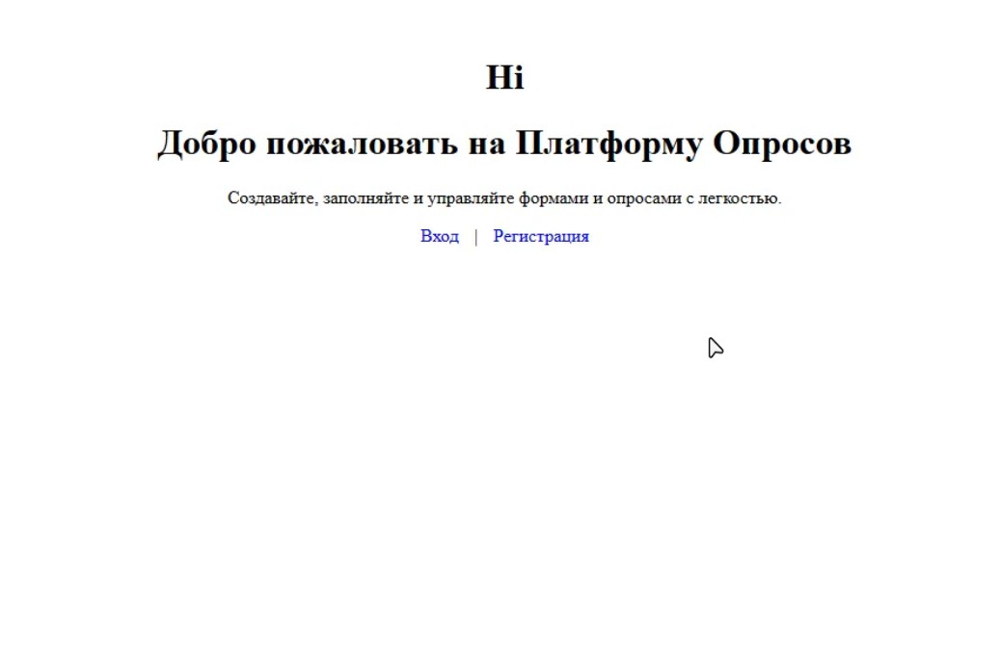
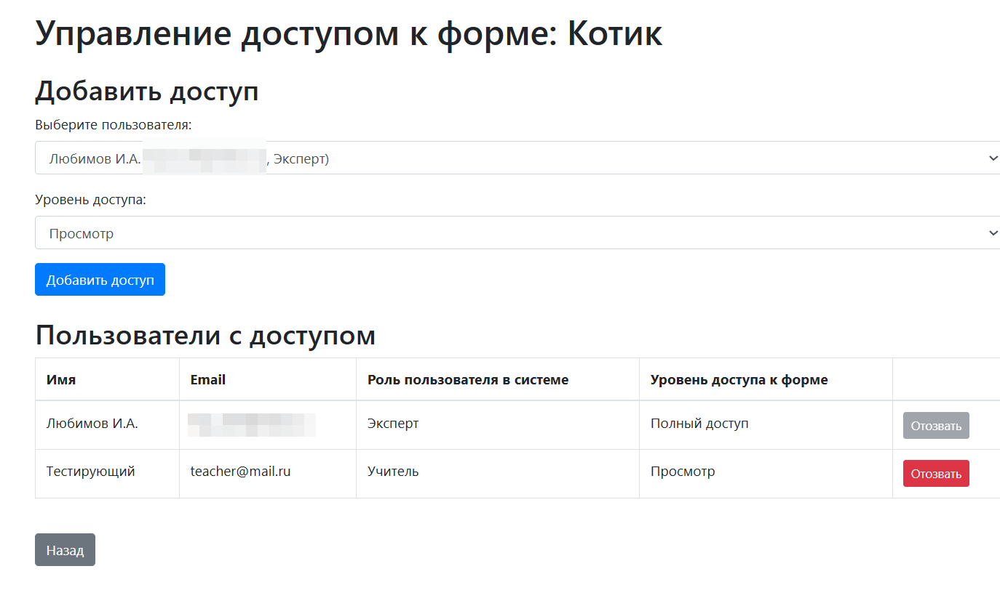

# Платформа Опросов - Руководство пользователя

## Содержание
- [Платформа Опросов - Руководство пользователя](#платформа-опросов---руководство-пользователя)
  - [Содержание](#содержание)
  - [Введение](#введение)
  - [Архитектура системы](#архитектура-системы)
    - [Тип интеллектуальной системы](#тип-интеллектуальной-системы)
    - [Модель представления знаний](#модель-представления-знаний)
    - [Структурная схема системы](#структурная-схема-системы)
  - [Начало работы](#начало-работы)
    - [Главная страница](#главная-страница)
    - [Регистрация](#регистрация)
    - [Вход в систему](#вход-в-систему)
  - [Панель управления](#панель-управления)
  - [Работа с формами](#работа-с-формами)
    - [Создание формы](#создание-формы)
    - [Редактирование формы](#редактирование-формы)
    - [Управление доступом](#управление-доступом)
    - [Заполнение формы](#заполнение-формы)
    - [Просмотр результатов](#просмотр-результатов)
  - [Управление диагнозами](#управление-диагнозами)
  - [Правила и рекомендации](#правила-и-рекомендации)
  - [Экспорт данных](#экспорт-данных)

## Введение

Платформа Опросов представляет собой экспертную систему для создания и управления формами с возможностью автоматической диагностики на основе ответов пользователей. Система позволяет:
- Создавать настраиваемые формы для сбора данных
- Управлять правами доступа к формам
- Создавать диагнозы и привязывать их к формам
- Настраивать правила для автоматического определения диагнозов на основе ответов
- Экспортировать результаты в Excel для дальнейшего анализа

## Архитектура системы

### Тип интеллектуальной системы

Платформа Опросов классифицируется как Экспертная система, так как:
- Использует заранее определенные правила для принятия решений (диагнозов)
- Обрабатывает входные данные (ответы на формы) для генерации выходных данных (диагнозов и рекомендаций)
- Имеет базу знаний (диагнозы и правила)
- Использует механизм логического вывода (обработка правил)

### Модель представления знаний

Система использует продукционную модель представления знаний, что подразумевает:
- Представление знаний в виде правил "если-то" (например, если балл находится между X и Y, то диагноз Z)
- Четко определенные правила с условиями и действиями
- Возможность приоритезации и изменения правил
- Обработку правил для принятия решений

### Структурная схема системы

## Начало работы

### Главная страница

Главная страница сервиса предоставляет доступ к основным функциям системы:
- Вход для зарегистрированных пользователей
- Регистрация новых пользователей

### Регистрация

Для создания новой учетной записи необходимо указать:
- Полное имя пользователя
- Email (будет использоваться для входа)
- Пароль
- Подтверждение пароля

После успешной регистрации вы сможете войти в систему, используя указанный email и пароль.

### Вход в систему

Для входа в систему используйте:
- Email, указанный при регистрации
- Пароль

## Панель управления

После успешной авторизации вы попадаете на панель управления (dashboard.php), где отображается список ваших форм. Для каждой формы доступны следующие действия:
- Показать результаты - просмотр ответов и статистики
- Заполнить - перейти к заполнению формы
- Редактировать - изменить структуру и содержание формы
- Управление доступами - настройка прав доступа к форме
- Экспортировать - выгрузка результатов в Excel
- Удалить - удаление формы

На панели управления также доступны кнопки:
- "Создать новую форму" - для создания новой формы
- "Управление диагнозами" - для работы с диагнозами
- "Выйти" - для выхода из системы

## Работа с формами

### Создание формы

При создании новой формы (create_form.php) вам нужно заполнить следующие разделы:

1. Основная информация:
   - Название формы
   - Описание формы (опционально)

2. Страницы и вопросы:
   - Форма может содержать несколько страниц
   - Для каждой страницы можно добавлять вопросы
   - Для каждого вопроса указывается:
     * Текст вопроса
     * Тип вопроса (например, "Один из вариантов")
     * Варианты ответов
   - Доступны кнопки:
     * "+ Добавить вариант" - для добавления вариантов ответа
     * "Удалить вопрос" - для удаления текущего вопроса
     * "+ Добавить вопрос" - для добавления нового вопроса
   - Кнопка "+ Добавить страницу" для создания новой страницы формы

3. Правила результатов:
   - Создание правил для оценки ответов
   - Настройка диапазона баллов (от/до)
   - Привязка правил к конкретным страницам или всей форме
   - Настройка текста результата и диагноза

### Редактирование формы

В режиме редактирования формы (edit_form.php) доступны следующие элементы:

1. Основная информация:
   - Название формы (редактируемое поле)
   - Описание формы (редактируемое поле)

2. Вопросы:
   Для каждого вопроса можно настроить:
   - Текст вопроса
   - Тип вопроса (например, "Один вариант", "Короткий текст")
   - Варианты ответов (для вопросов с вариантами):
     * Текст ответа
     * Баллы за ответ
   
   Для вопросов без вариантов ответа (например, "Короткий текст") система показывает сообщение "Для этого вопроса нет вариантов ответов"

Страница позволяет полностью настроить структуру формы, включая типы вопросов, варианты ответов и систему начисления баллов за каждый ответ.

### Управление доступом

Страница управления доступом (manage_access.php) позволяет настраивать права доступа к форме:

1. Добавление нового доступа:
   - Выбор пользователя из списка
   - Установка уровня доступа:
     * Просмотр
     * Полный доступ

2. Управление существующими правами:
   В таблице отображаются все пользователи с доступом к форме:
   - Имя пользователя
   - Email
   - Роль пользователя в системе (например, Эксперт, Учитель)
   - Уровень доступа к форме
   - Кнопка "Отозвать" для удаления доступа

3. Навигация:
   - Кнопка "Назад" для возврата к предыдущей странице

### Заполнение формы

При заполнении формы (fill_form.php) пользователь видит:

1. Заголовок и описание формы:
   - Название формы
   - Описание (если есть)

2. Индикатор прогресса:
   - Показывает текущую страницу и общее количество страниц
   - Визуальный прогресс-бар

3. Вопросы формы:
   - Текст каждого вопроса
   - Варианты ответов в соответствующем формате:
     * Радио-кнопки для выбора одного варианта
     * Текстовые поля для свободных ответов

4. Навигация:
   - Кнопка "Далее" для перехода к следующей странице
   - Номер текущей страницы (например, "Страница 1 из 2")

5. Информация о системе:
   - Копирайт и год в нижней части страницы

### Просмотр результатов

Страница просмотра результатов (view_results.php) отображает все ответы на форму в виде таблицы со следующими колонками:

1. Пользователь - имя пользователя, заполнившего форму
2. Дата заполнения - дата и время отправки формы
3. Результаты - ссылка "Просмотр" для детального просмотра ответов
4. Оценка - статус оценки результата (например, "Не оценено")

Дополнительные функции:
- Ссылка "Назад к панели администратора" для возврата к управлению формой
- Возможность просмотра индивидуальных результатов через ссылку "Просмотр"
- Хронологическая сортировка результатов по дате заполнения

## Управление диагнозами

Страница управления диагнозами (manage_diagnoses.php) содержит следующие разделы:

1. Создание нового диагноза:
   - Поле для ввода названия диагноза
   - Кнопка "Создать диагноз"

2. Список существующих диагнозов:
   - Отображение названий всех созданных диагнозов
   - Для каждого диагноза показываются его правила

3. Правила диагнозов:
   Для каждого правила отображаются:
   - Форма - идентификатор формы
   - Область применения
   - Страница формы
   - Диапазон баллов
   - Текст результата
   - Приоритет
   - Действия (Редактировать, Удалить)

4. Добавление нового правила:
   - Выбор формы
   - Выбор области применения
   - Указание страницы (если выбрана конкретная страница)
   - Настройка диапазона баллов (от/до)
   - Ввод текста результата
   - Установка приоритета
   - Кнопка "Создать правило"

## Правила и рекомендации

Страница редактирования правила (edit_rule.php) содержит следующие поля:

1. Основные параметры:
   - Форма - выбор формы, к которой применяется правило
   - Область - выбор области применения правила (например, "Вся форма")
   - Страница - указание конкретной страницы (если выбрана область "Конкретная страница")

2. Условия срабатывания:
   - Диапазон баллов:
     * От - минимальное количество баллов
     * До - максимальное количество баллов

3. Результат:
   - Текст результата - сообщение, которое будет показано при срабатывании правила
   - Приоритет - числовое значение для определения порядка применения правил
   - Диагноз - выбор диагноза, который будет установлен при срабатывании правила

4. Действия:
   - Кнопка "Сохранить изменения" для применения внесенных изменений

## Экспорт данных

Функция экспорта (export_excel.php) автоматически генерирует Excel-файл, содержащий:
- Все ответы пользователей на вопросы формы
- Итоговые баллы за каждый ответ
- Определенные системой диагнозы
- Сгенерированные рекомендации

Файл создается в формате .xlsx и сразу начинает загружаться после нажатия на кнопку "Экспортировать" в интерфейсе просмотра результатов формы.

---

Для получения дополнительной информации или технической поддержки обратитесь к администратору системы.
